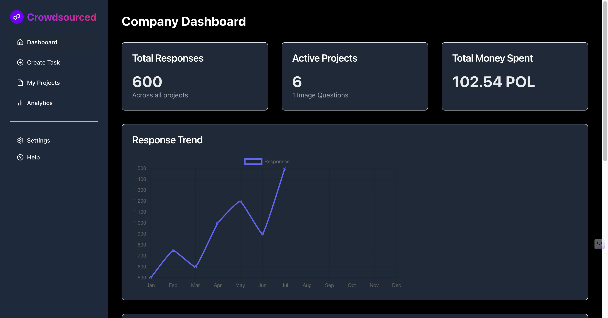
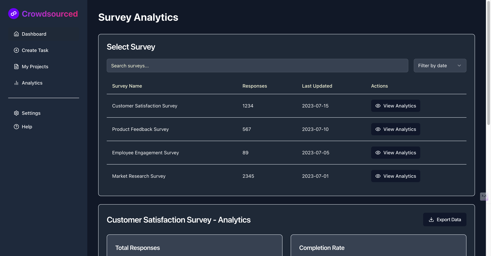

# Crowdsourced

Crowdsourced is an innovative platform designed to connect two distinct user groups: Companies and Voters. The platform facilitates the collection of large-scale opinions, responses, and feedback from a diverse user base, offering a unique opportunity for companies to enhance their products, services, and models. By leveraging the power of crowdsourcing, cryptocurrency, and Linea technology, Crowdsourced aims to become a trusted and effective solution for gathering global insights.

## Introduction

Crowdsourced is an innovative platform designed to connect two distinct user groups: Companies and Voters. The platform facilitates the collection of large-scale opinions, responses, and feedback from a diverse user base, offering a unique opportunity for companies to enhance their products, services, and models. By leveraging the power of crowdsourcing, cryptocurrency, and Linea technology, Crowdsourced aims to become a trusted and effective solution for gathering global insights.

## Target Users

1. **Companies**: Individuals or organizations that require extensive feedback, opinions, and responses. These can include large and mid-cap companies looking to train machine learning models, gather customer insights, or conduct market research.
2. **Voters**: Participants who complete tasks posted by Companies. In return, Voters are rewarded with cryptocurrency, providing them with a tangible incentive to engage with the platform.

## Key Features

1. **Task Posting by Companies**:
   - Companies can post tasks that require feedback or opinions from a large number of Voters.
   - Tasks may include surveys, product testing, opinion polls, or any activity that benefits from crowdsourced input.
   - Companies are required to prepay an amount to the platform before their tasks are posted, ensuring the credibility and reliability of the platform.

2. **User Participation and Earnings**:
   - Voters can browse and select tasks to complete based on their preferences and skills.
   - Upon successful completion of tasks, Voters earn cryptocurrency as a reward.
   - This system offers a new and engaging way for individuals to earn money while contributing valuable insights.

3. **Linea Technology Integration**:
   - Crowdsourced leverages Linea technology to enable fast, low-cost, and secure transactions on the platform.
   - By utilizing Linea, the platform ensures scalability, allowing for a seamless experience even with a large number of Voters and transactions.
   - Linea's interoperability with Ethereum enhances the platform’s credibility and expands its reach within the blockchain ecosystem.

4. **Payment System**:
   - Companies must deposit the payment to the platform before posting tasks, which ensures that rewards for Voters are secured and distributed fairly.
   - The platform’s credibility is further enhanced by this requirement, ensuring that all posted tasks are legitimate.

5. **Global Reach**:
   - Crowdsourced enables Companies to tap into a global audience, gathering diverse opinions and feedback from Voters around the world.
   - The platform is particularly valuable for companies looking to expand their market reach and understand different cultural perspectives.

## Benefits

- **For Companies**: Crowdsourced offers a reliable and efficient way to gather large-scale feedback and opinions, crucial for training models, improving products, and making informed business decisions.
- **For Voters**: The platform provides an accessible and rewarding way to earn cryptocurrency by participating in tasks that align with their interests.

### Screenshots

Here are some screenshots showcasing various parts of the platform:

#### Landing Page

*The initial page where users can learn about the platform and its benefits.*

#### Register Page

*The registration page for new users to sign up and join the platform.*

#### Company Dashboard

*A comprehensive dashboard for companies to manage their tasks and view analytics.*

#### Analytics

*Detailed analytics page for companies to analyze the feedback and data collected.*

#### Voter Dashboard

*The dashboard for voters to view available tasks and track their earnings.*

#### Post Question

*Interface for companies to post new questions and tasks for voters.*

#### Submit Form

*Form submission page for voters to submit their responses.*

### Landing Page

## Use Cases

- **Training AI Models**: Companies can use the platform to gather data needed to train machine learning models, benefiting from diverse inputs that enhance model accuracy.
- **Product Feedback**: Businesses can obtain real-time feedback on new products, helping them make data-driven decisions for improvements.
- **Market Research**: Organizations can conduct large-scale surveys to gauge public opinion, identify trends, and gain insights into consumer behavior.

## Conclusion

Crowdsourced represents a groundbreaking approach to crowdsourcing, combining the benefits of a trusted platform with the incentives of cryptocurrency and the technological advantages of Linea. By facilitating the exchange of valuable feedback for financial rewards, the platform serves as a powerful tool for both Companies and Voters, fostering a mutually beneficial relationship that drives innovation and insight on a global scale.